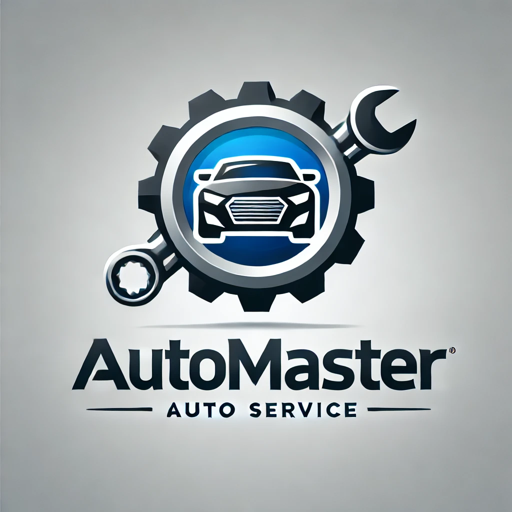

# Часто задаваемые вопросы (FAQ)

В этом разделе мы собрали ответы на популярные вопросы о приложении **"Автосервис"**. Если вы не нашли нужную информацию, обратитесь в поддержку через раздел **"Обратная связь"**.

---

## 1. Как я могу записаться на обслуживание автомобиля?

Для записи на обслуживание выполните следующие шаги:

1. Откройте приложение **"Автосервис"**.
2. Перейдите в раздел **"Запись на обслуживание"**.
3. Выберите необходимую услугу, удобные дату и время.
4. Подтвердите запись.

После записи вы получите уведомление с подтверждением.

---

## 2. Можно ли изменить дату или время записи?

Да, вы можете изменить данные записи, если услуга ещё не начата. Для этого:

1. Зайдите в раздел **"Мои заказы"**.
2. Выберите нужный заказ.
3. Нажмите **"Изменить запись"** и выберите новую дату или время.

Обратите внимание, что изменение возможно только при наличии свободных слотов.

---

## 3. Как отследить статус ремонта автомобиля?

Чтобы отследить статус ремонта:

1. Перейдите в раздел **"Мои заказы"**.
2. Найдите текущий заказ.
3. Просмотрите статус, например: "Диагностика", "Ремонт", "Готово".

Вы также будете получать push-уведомления при изменении статуса.

---

## 4. Какие услуги предоставляются в автосервисе?

Приложение отображает полный список доступных услуг, включая:

- Технический осмотр.
- Замена масла и фильтров.
- Ремонт двигателя.
- Диагностика электроники.
- И многое другое.

Вы можете ознакомиться с полным перечнем услуг в разделе **"Услуги"**.

---

## 5. Какие устройства поддерживаются приложением?

Приложение доступно для устройств с операционными системами:

- Android версии 10 и выше.
- iOS версии 13.0 и выше.

Подробные инструкции по установке можно найти в разделах [Android](usage/installation/android.md) и [iOS](usage/installation/ios.md).

---

## 6. Как я могу связаться с поддержкой?

Вы можете связаться с поддержкой через приложение:

1. Откройте раздел **"Обратная связь"**.
2. Заполните форму, указав проблему.
3. Наши специалисты свяжутся с вами в ближайшее время.

---

Если у вас остались вопросы, не упомянутые в этом разделе, напишите нам через обратную связь. Мы всегда рады помочь!
